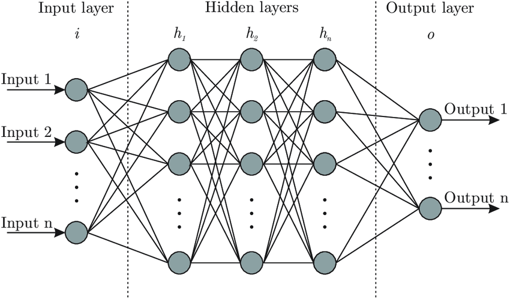

How does data flow through a neural network?

In NNs, information is passed from the input layer $i$ to intermediate *hidden* $h_1, h_2, ... h_n$ layers, and finally to the output layer $o$.

But why do we have so many layers? We're "learning", but what is actually happening to the information?

Crucially, we can never *add* new **information** to existing information as it is propagated through the layers of a neural network.

If we represent the input, hidden, and output layers as random variables, $X$, $Y$, $Z$, with the dependency

$$
X \rightarrow Y \rightarrow Z
$$

Then the *mutual information* of our random variables is such that:

$$
I(X;Z) \leq I(X;Y) \tag{1}
$$

Why is this the case? One intuitive answer might be that we can't add more information to our network. We can either keep the existing information content ($=$), or decrease it ($<$).

It's easy to get tripped up on intuition, so let's treat this formally.

## Proof

The mutual information for two random variables, $X$ and $Y$, measures how much *uncertainty* is reduced about variable $X$ when $Y$ is observed.

$$
I(X;Y) = H(X) + H(Y) - H(X, Y) \tag{2}
$$

Let's think about the extreme cases here.

We know that $H(X, Y) = H(X) + H(Y|X)$

This is the *chain rule of entropy*, and it's actually the [log transformed](https://www.mathcentre.ac.uk/resources/uploaded/mc-bus-loglaws-2009-1.pdf) version of the joint probability from the good ol' product rule $p(x, y) = p(x)p(y|x)$ (take a second to think about why!)

So we can write our mutual information equation as:

$$
I(X;Y) = H(X) + H(Y) - H(X) - H(Y|X) \tag{3}
$$

The $H(X)$ terms cancel out, leaving us with

$$
I(X;Y) = H(Y) - H(Y|X) \tag{4}
$$

Now, going back to our dependency, note that if $X \rightarrow Y \rightarrow Z$ is *Markovian*, then by definition:
- $Y$ is computed based on *just* $X$ and
- $Z$ is computed based on *just* $Y$.

Since in our case, $X$ (the input) completely determines $Y$ (intermediate layers), then once we observe $X$ there is no uncertainty left about $Y$ at all, and $H(Y|X) = 0$.

Thus,

$$
I(X;Y) = H(Y) \tag{5}
$$

By the same argument, we can see that

$$
I(X;Z) = H(Z) \tag{6}
$$

And applying entropy chain rule:
- $H(Y,Z) = H(Y) + H(Z|Y)$
- $H(Y,Z) = H(Z) + H(Y|Z)$

Recall that $H(Z|Y)=0$, and set these two equal:

$$
H(Y) = H(Z) + H(Y|Z) \tag{7}
$$

We can write our entropy in terms of mutual information to get:

$$
I(X;Y) = I(X;Z) + H(Y|Z) \tag{8}
$$

Uncertainty must always be non-negative (no such thing as negative uncertainty.)

So we can rewrite the above as a *bound*

$$
I(X;Z) \leq I(X;Y) \tag{9}
$$

And that's how you get the [Data Processing Inequality](https://en.wikipedia.org/wiki/Data_processing_inequality).

## Implications

But let's think about what this means. If every layer $k+1$ can have *no more* information than layer $k$, how come the later layers of a neural network work the best (e.g. in a classifier)?

To answer this, I turn to [Understanding intermediate layers using linear classifier probes](https://arxiv.org/abs/1610.01644):

> *One of the important lessons is that neural networks are really about distilling computationally-useful representations, and they are not about information contents as described by the field of Information Theory.*
