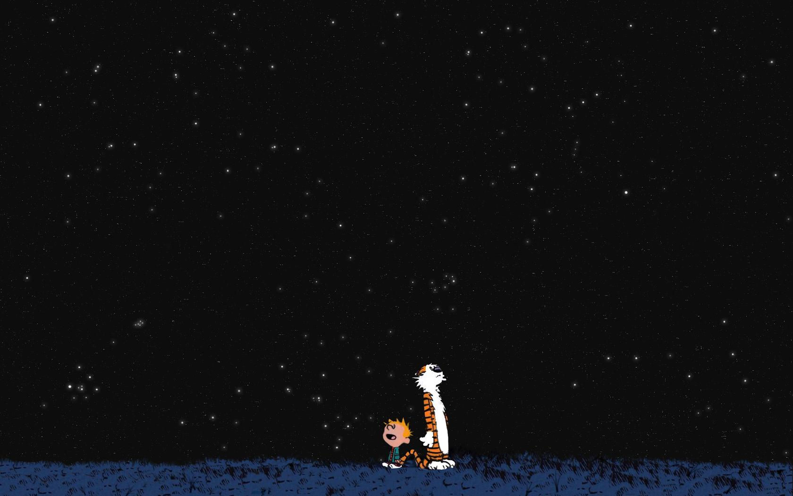
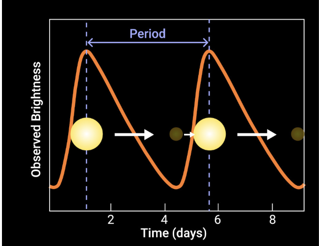
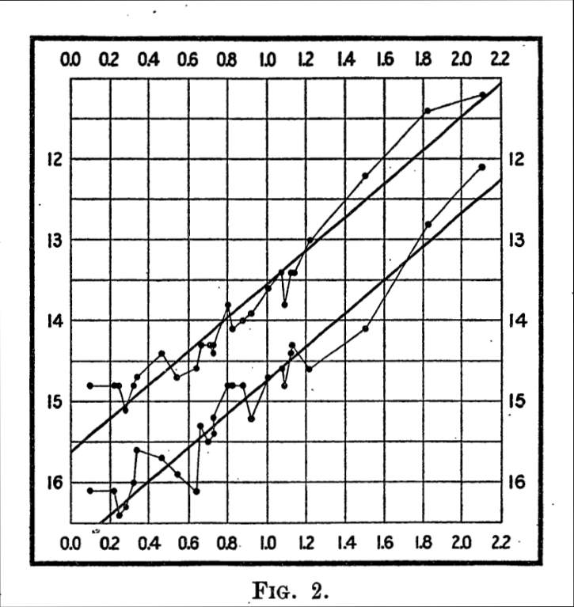
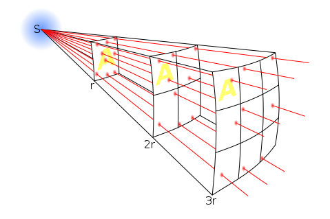
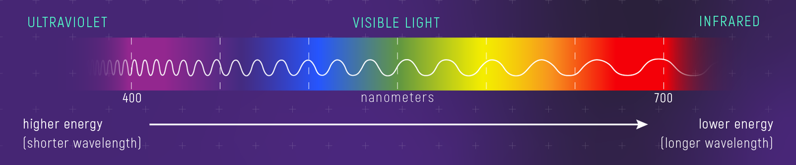
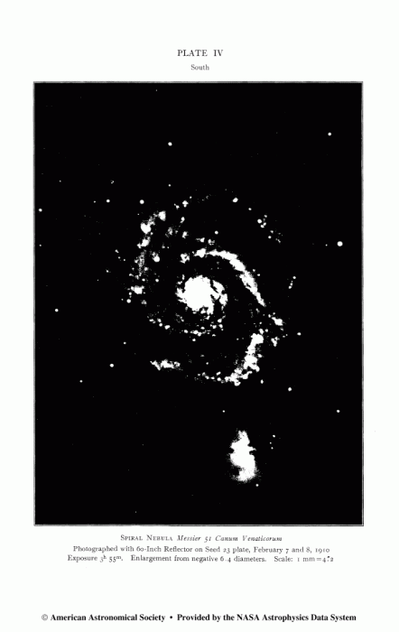
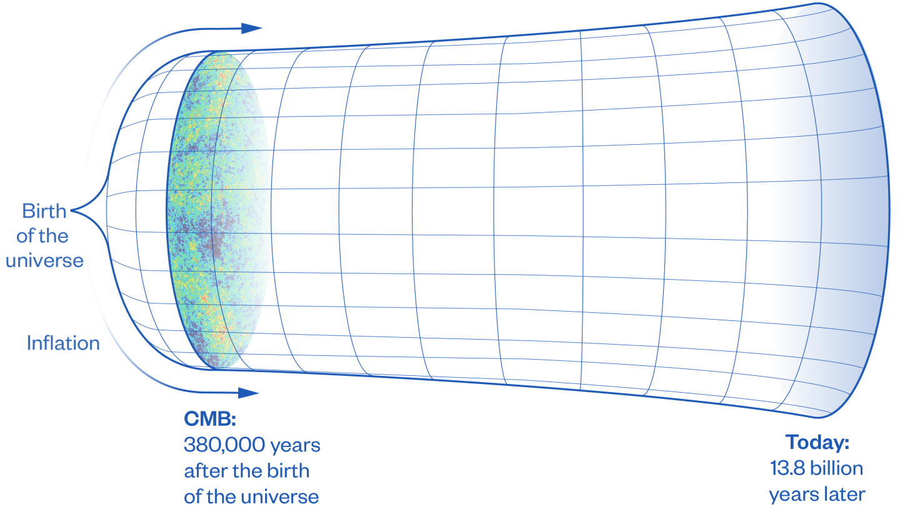

<small class="image-caption">Source: <a href="https://www.gocomics.com/calvinandhobbes/1992/06/30">Calvin and Hobbes</a></small>

What do we know about the beginning of the universe?

Our very best guess comes from astronomy.

If we know how far away galaxies are (*distance*), and how fast they appear to be receding (*velocity*), we can begin to ask whether the universe has changed over *time*.

So, how do we know how far away objects are in space?

Henrietta Swan Leavitt, an early 20th-century astronomer at the Harvard College Observatory, noticed that a certain group of stars changed in brightness over time. These stars, called *Cepheid variables*, pulsated in a regular pattern.

Leavitt collected a lot of data and noticed something striking: the longer a Cepheid's pulsation period, the more luminous the star really was.

This is [Leavitt's Law](https://en.wikipedia.org/wiki/Period-luminosity_relation):

Once you know how bright something really *is*, you can compare that to how bright it *looks* from Earth. That comparison tells you how far away it is (*distance*).

The farther you get away from a source of light, the dimmer it gets.

Because light travels outward in every direction, the same light gets spread over the surface of a larger and larger sphere ($4\pi r^2$). Double the distance, and it is spread over four times as much area. Triple it, and it's nine times.

---

Now, how fast are objects moving in space?

Fun fact: our eyes detect differences in wavelength and energy of light as differences in color.

<small class="image-caption">Source: <a href="https://science.nasa.gov/asset/webb/relationship-between-color-wavelength-and-energy/">NASA</a></small>

When a light source is moving away from us, its light is stretched to longer wavelengths, making it appear more *red*.

This is known as redshift.

Light that is moving towards the observer is more blue. This is - you guessed it - *blueshift*.

In the 20th century, astronomers had catalogued many of the objects in the night sky.
* Stars, which are bright
* Nebulas, which look like dust clouds

Spiral nebulas are a class of nebulas that were the subject of much debate.

Some prominent astronomers thought they were clouds of gas inside the Milky Way, waiting to form new solar systems. Others suspected they were "island universes", like the Milky Way itself.

Enter Vesto Slipher. Over several years he painstakingly collected spectra of spiral nebulae: photographic records of their light split into wavelengths. By 1917, he discovered that twenty-one of the first twenty-five he measured were redshifted!

This suggested that the spiral nebulae were moving *away* from us.

But there was still a deeper question: what were they?

Using Cepheid variables, Hubble showed that some of these "nebulae" were too far away to be inside the Milky Way. They were entire *galaxies* of their own.

Now the redshifts mattered much more. Other galaxies themselves were moving away from us!

Hubble put the distance and velocity data together and noticed that the *farther away a galaxy is, the faster it appears to move away from us*.

---

Okay, if the universe is expanding now, what did it look like before?

In the mid-20th century, there were two schools of thought:
* **Big Bang Theory** - if the universe is expanding now, it was once compressed into a *tiny* region. When you put matter together, it heats. When you put it apart, it cools. This was first theorized by Georges Lemaitre, who was both an astronomer and a Catholic priest, and independently by Alexander Friedmann.
* **Steady State Theory** - the universe is expanding, but new matter is spontaneously generated. So the universe has always been pretty much the same. This view was defended by Fred Hoyle, among others.

Hubble's work by itself cannot distinguish between these two hypotheses.

If you take this *Big Bang theory* seriously, the light from that hot, dense early state can't have just disappeared. As the universe expanded, that ancient light would have been stretched into ever longer wavelengths. By now, it should appear as a cold, microwave glow, from every direction.

But even though the once tiny region is now our universe, we'd expect the temperature to be uniform - just much colder than it once was.

This is what Ralph Alpher and Robert Herman, building on the work of George Gamow, theorized in 1948.

In 1964, Bell Labs researchers were using what was the most sensitive antenna in human history. Their antenna had a problem - it kept on hissing. They tried many experiments - including cleaning up pigeon poop - to identify the source of the hiss, but after many trials, discovered that the hiss was coming from *every possible direction*.

This observed radiation matched the theoretical predictions of Alpher and Herman!

<small class="image-caption">Source: <a href="https://www.princeton.edu/news/2025/03/18/new-high-definition-images-released-baby-universe">Princeton University</a></small>

The hiss was not a defect in the antenna.

It was the afterglow of the beginning of the universe.

---

Further reading:
- Leavitt and Cepheids: [Heidelberg STRUCTURES Blog](https://structures.uni-heidelberg.de/blog/posts/2024_03_womens_day/index.php)
- Big Bang cosmology: [ICTP lecture notes](https://web.archive.org/web/20260214080744/https://indico.ictp.it/event/11072/session/8/material/0/0.pdf)
- Distance, redshift, and Hubble's law: [Penn State Astro 801](https://courses.ems.psu.edu/astro801/content/l9_p2.html)
- CMB discovery story: [IEEE Spectrum](https://spectrum.ieee.org/big-bang-theory-discovery)
